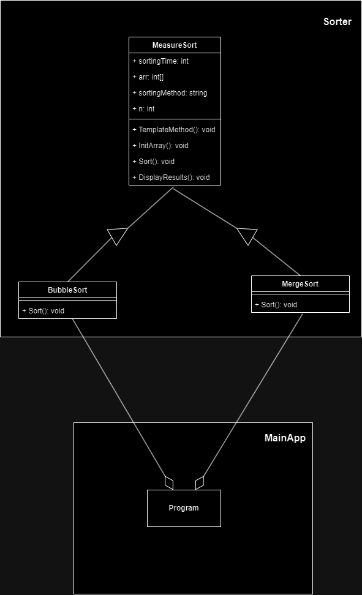

# Template Method Pattern Demo

## Overview

The Template Method design pattern is a behavioral design pattern that provides a skeletal structure for an algorithm but allows its steps to be defined by subclasses. This pattern defines the common algorithm structure in a base class and lets subclasses customize some of the steps without changing the overall structure. It promotes code reusability and ensures that the algorithm's core logic remains consistent across different implementations.

## Design

The project defines a sorting algorithm time calculator. An array of size `n` is initialised with random numbers. `MeasureSort` implements the initialisation and displaying, whereas subclasses like `BubbleSort` and `MergeSort` implements the sorting algorithm. Thus, Demonstrating the `Template Method` design pattern.
